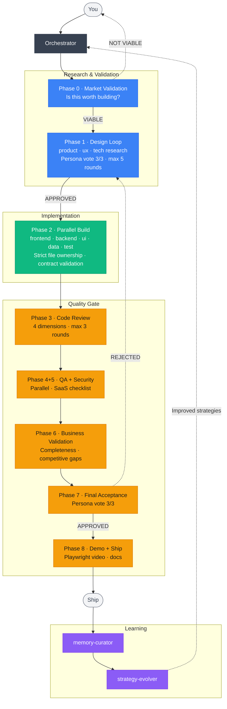

# solo-dev

> Your AI co-founder that turns a product idea into a shipping SaaS — research, design, implementation, review, and a demo video for every feature.

[](https://zee-sandev.github.io/solo-dev/)
[](LICENSE)

**solo-dev** is a Claude Code plugin that orchestrates 17 specialized agents through a structured development lifecycle. You bring the idea; it handles market validation, architecture design, parallel implementation, quality gates, and continuous learning — all within your terminal.

**[Read the full documentation →](https://zee-sandev.github.io/solo-dev/)**

---

## Why solo-dev?

Building a SaaS alone usually means wearing every hat: researcher, designer, architect, developer, QA, and product manager. solo-dev gives you a team of agents that handle each role, so you can focus on decisions that matter.

- **From zero to roadmap** — Market research, competitor gap analysis, persona generation, and AI-enhanced feature suggestions before writing any code
- **8-phase feature lifecycle** — Every feature goes through market validation, design, parallel implementation, code review, QA, security, business validation, and demo recording
- **Self-improving** — Agents learn from every cycle and refine their strategies across sessions and projects
- **Token-efficient** — Index-first memory (~200 tokens at startup) and Repomix-powered code exploration keep costs low
- **Works with your stack** — Adapts to Next.js, Django, Go, Spring Boot, Python, and more

---

## Getting Started

### Install from Marketplace

```bash
# Step 1: Register the solo-dev marketplace
claude plugin marketplace add zee-sandev/solo-dev

# Step 2: Install the plugin
claude plugin install solo-dev
```

That's it. You're ready to go.

### Optional Plugins

These plugins enhance solo-dev's output quality. Everything works without them — solo-dev falls back to its bundled skills automatically.

```bash
claude plugin install impeccable            # Superior UI polish and design critique
claude plugin install ui-ux-pro-max         # Advanced UX design patterns
claude plugin install everything-claude-code # Stack-specific backend, testing, deployment
```

### Manual Install

Prefer to clone directly?

```bash
git clone https://github.com/zee-sandev/solo-dev.git ~/.claude/plugins/solo-dev
```

---

## Four Ways to Start

### 1. Start from a new idea

```
/solo-dev:start-from-idea
```

Guides you through 6 phases of product discovery:
idea exploration → market reality check → competitor gap analysis → persona generation → AI-enhanced features → prioritized roadmap.

### 2. Start from existing notes or a spec

```
/solo-dev:init
```

Already have requirements, a brief, or scattered notes? `init` sets up the project structure and memory system.

### 3. Onboard an existing codebase

```
/solo-dev:init
```

When solo-dev detects source files but no product docs, it enters **onboarding mode** — analyzes your codebase silently, then cross-checks understanding with you in just 3 interactions. The codebase speaks first, questions come after.

### 4. Start from a project template

```
/solo-dev:init
```

If your project already has `CLAUDE.md`, `docs/`, or `.claude/agents/`, solo-dev enters **foundation mode** — reads existing documentation, delegates implementation to your template's agents (they know the conventions best), tags example code for automatic replacement, and asks just one question: *"What are you building on this foundation?"*

### Build the next feature

```
/solo-dev:next-feature
```

Picks the next eligible feature from your roadmap and runs the full 8-phase lifecycle automatically.

---

## Commands

| Command | What it does |
|---------|-------------|
| `/solo-dev:start-from-idea` | Turn a rough idea into a validated, prioritized roadmap |
| `/solo-dev:init` | Initialize a project — works for new concepts, existing codebases, and templates |
| `/solo-dev:next-feature` | Build and ship the next feature through all 8 phases |
| `/solo-dev:status` | See where you are — roadmap progress, current phase, token usage |
| `/solo-dev:set-autonomy` | Fine-tune how much solo-dev asks vs. decides on its own |
| `/solo-dev:evolve` | Let agents analyze their performance and improve their strategies |
| `/solo-dev:rollback [id]` | Revert a feature — git, state, and memory all restored |
| `/solo-dev:resume` | Pick up where you left off after an escalation or pause |

---

## See It in Action

### Onboarding an existing codebase

```
> /solo-dev:init

  Packing codebase with Repomix...
  Analyzing in parallel: tech-architect · product-researcher · ux-researcher

  ── Stack ───────────────────────────────────────────────
  Framework   Next.js 14 (App Router)
  ORM         Prisma + PostgreSQL
  Auth        NextAuth.js · Payments  Stripe

  ── Product Understanding ────────────────────────────────
  Based on the codebase, here's my understanding:

  A B2B web app where users track keyword rankings and monitor
  search position over time. Multi-tenant, team-based access,
  subscription model via Stripe.

  1. Does this match your product? Correct anything wrong.
  2. What's the most important thing I might have missed?

  > Almost right — we also have a content brief generator.
    Users are content managers, not just SEO people.

  ── Feature Map ─────────────────────────────────────────
  ┌───┬──────────────────────────┬──────────┬──────────────────────────────┐
  │ 1 │ Keyword tracking         │ Complete │ Full API + UI + tests passing │
  │ 2 │ SERP position graph      │ Complete │ Full API + UI + tests passing │
  │ 3 │ Content brief generator  │ Partial  │ UI exists, API has no tests   │
  │ 4 │ Team management          │ Partial  │ UI complete, no backend       │
  │ 5 │ Billing / subscriptions  │ Stub     │ Stripe configured, no flow    │
  └───┴──────────────────────────┴──────────┴──────────────────────────────┘

  ── Docs Generated ────────────────────────────────────────
  ✓  roadmap.md — 2 shipped, 3 WIP, 2 planned
  ✓  personas.md · patterns.md · decisions.md

  Ready. Run /solo-dev:next-feature to start building.
```

### From idea to roadmap

```
> /solo-dev:start-from-idea

Orchestrator: Tell me about your idea — even a rough description works.

User: A tool that helps content teams track blog rankings
      and get AI suggestions for improvement.

[... guided conversation, one question at a time ...]

✓  4 competitors analyzed — 3 whitespace opportunities found
✓  2 personas generated
✓  6 MVP features + 2 competitive moat features defined
✓  Roadmap generated with dependency graph

Run /solo-dev:init to start building.
```

### Building a feature

```
> /solo-dev:next-feature

Building: A1 — SERP Position Tracker

  ✓  Market validated
  ✓  Design approved — 3/3 personas approve
  ✓  Implementation complete (4 agents in parallel)
  ✓  Code review passed (2 rounds)
  ✓  QA + Security passed
  ✓  Business validation approved
  ✓  Demo recorded → docs/demos/A1/demo.mp4

  Feature shipped. Next up: A2 — Content Brief Generator
```

---

## How It Works

### Feature Lifecycle (8 Phases)

Every feature passes through research, implementation, and quality gates before shipping.



### Agent Roster (17 agents)

| Layer | Agents | What they do |
|-------|--------|-------------|
| **Research** | `orchestrator` · `product-researcher` · `ux-researcher` · `tech-architect` | Coordinate, research markets, design UX, plan architecture |
| **Validation** | `market-validator` · `persona-validator` · `business-validator` · `security-reviewer` | Gate quality — commercial viability, user fit, business logic, security |
| **Implementation** | `frontend-agent` · `backend-agent` · `ui-agent` · `data-agent` · `test-agent` | Build in parallel with strict file ownership and contract validation |
| **Learning** | `code-reviewer` · `qa-validator` · `memory-curator` · `strategy-evolver` | Review quality, compress memory, improve strategies over time |

> **Foundation projects:** If your template includes its own `.claude/agents/`, solo-dev delegates implementation to them and focuses on research, validation, and learning.

### Memory System

Designed to stay lean. Only the index loads at session start (~200 tokens). Everything else is pulled on-demand.

```
docs/agents/memory/
  index.md            ← Always loaded (~200 tokens)
  patterns.md         ← On-demand: coding patterns
  decisions.md        ← On-demand: architecture decisions
  cr_learnings.md     ← On-demand: code review insights
  bv_learnings.md     ← On-demand: business validation insights
  performance-log.md  ← On-demand: agent performance data
  snapshots/          ← Pre-feature snapshots for rollback
```

---

## Configuration

All settings live in `.claude/solo-dev.local.md`:

```yaml
# How much solo-dev asks vs. decides
# Values: always-auto | always-ask | threshold:0.0-1.0
autonomy:
  tech_stack_selection: always-ask
  design_decisions: always-ask
  implementation: always-auto
  code_review_fixes: threshold:0.9

# Token usage tracking
# Modes: "fixed" (hard cap) | "subscription" (warn only) | "disabled"
token_budget:
  mode: disabled

# Auto-generate API docs when backend-agent creates endpoints
api_contracts:
  enabled: true
  output:
    mode: markdown
    markdown:
      path: docs/contracts

# Foundation mode settings (template projects only)
foundation:
  delegate_agents: true
  replace_examples: true
  final_cleanup: true
```

---

## Supported Stacks

Stack detection is automatic — solo-dev reads your project files at session start and loads the right skills.

| Stack | Detected by | Skills loaded |
|-------|------------|--------------|
| Next.js / React | `package.json` | `frontend-patterns` |
| Django | `manage.py` | `django-patterns`, `django-security`, `django-tdd` |
| Spring Boot | `pom.xml` / `build.gradle` | `springboot-patterns`, `springboot-security`, `jpa-patterns` |
| Go | `go.mod` | `golang-patterns`, `golang-testing` |
| Python | `requirements.txt` / `pyproject.toml` | `python-patterns`, `python-testing` |

Better Auth users get automatic access to the `claude.ai Better Auth` MCP server for accurate API patterns.

---

## Project Structure

Every solo-dev project follows this layout:

```
docs/
├── specs/              # Feature specifications
├── contracts/          # API contracts (auto-generated)
├── demos/              # Demo videos + docs per feature
│   └── {feature}/
│       ├── demo.mp4
│       └── demo.md
├── product/
│   ├── roadmap.md      # Prioritized feature roadmap
│   ├── personas.md     # Generated user personas
│   ├── competitive-analysis.md
│   └── backlog.md      # Future ideas
└── agents/
    └── memory/         # Agent learning memory
        ├── index.md
        ├── patterns.md
        ├── decisions.md
        └── snapshots/
```

---

## Rollback

Every feature is snapshotted before it begins — git commits, state file, and full memory.

```
/solo-dev:rollback feature-id
```

After rollback: **Re-attempt** | **Remove from roadmap** | **Decompose into smaller features**

---

## Bundled Skills

solo-dev ships fallback versions of its key dependencies. If the external plugin isn't installed, the bundled version (~70% capability) activates automatically.

| Bundled | Replaces |
|---------|---------|
| `ui-quality` | `impeccable:polish`, `impeccable:critique` |
| `ux-design` | `ui-ux-pro-max` |
| `backend-patterns` | `ecc:backend-patterns` |
| `security` | `ecc:security-review` |
| `tdd` | `ecc:tdd-workflow` |

---

## Documentation

For deeper details, see the [`docs/`](./docs) directory or the [online documentation](https://zee-sandev.github.io/solo-dev/).

| Document | Covers |
|----------|--------|
| [Design](docs/design.md) | Full system design and principles |
| [Agent Architecture](docs/agent-architecture.md) | All 17 agents — roles, ownership, skills |
| [Memory Flow](docs/memory-flow.md) | Memory layers, token budgets, session flow |
| [Agent Feedback](docs/agent-feedback-flow.md) | Inter-agent communication protocols |
| [Workflow](docs/workflow.md) | Phase-by-phase lifecycle and loop rules |

---

## Contributing

Contributions are welcome! Please open an issue first to discuss significant changes.

## License

MIT
