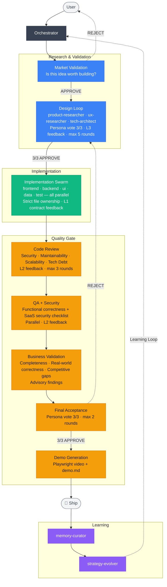
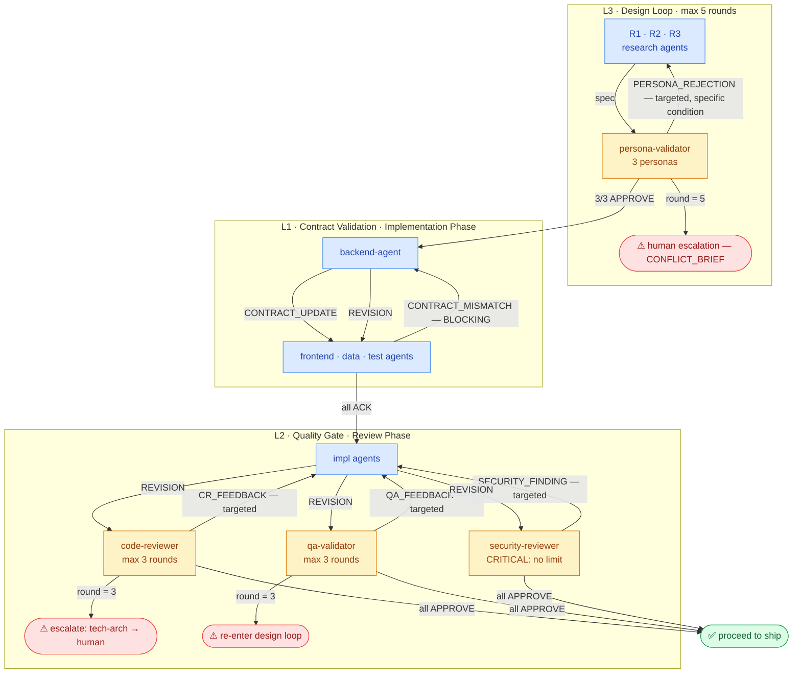
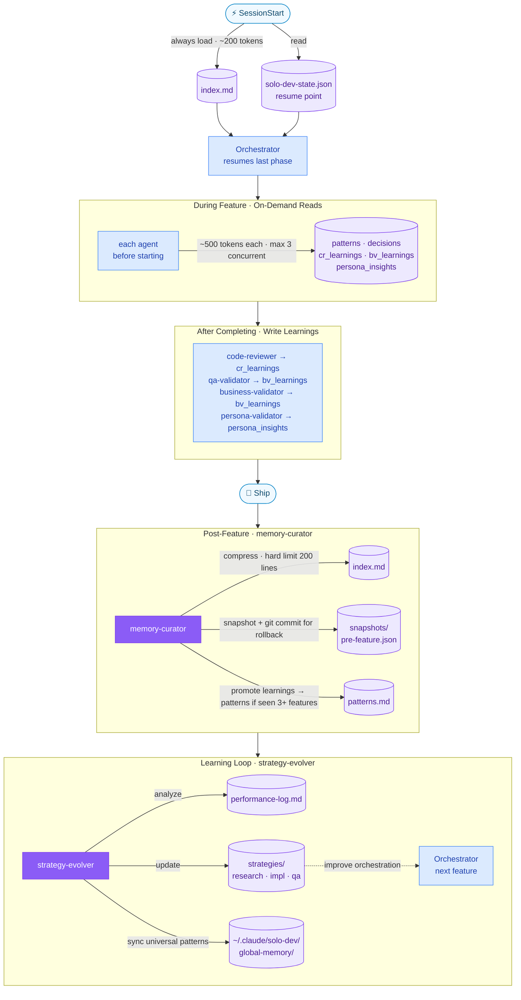

# solo-dev

> A Claude Code plugin that turns a product concept into a production-ready SaaS — with autonomous multi-agent orchestration, self-learning memory, and demo videos shipped with every feature.

---

## What It Does

You describe an idea. solo-dev handles the rest:

- **Idea → Roadmap** — Market validation, competitor gap analysis, AI-enhanced feature suggestions, and a prioritized roadmap — before writing a single line of code
- **Feature-by-feature development** — Each feature goes through research, parallel implementation, code review, QA, security, business validation, and demo recording in a structured 8-phase lifecycle
- **Self-learning** — Agents learn from every feature cycle and continuously improve their own strategies across sessions and projects
- **Token-efficient** — Index-first memory (~200 tokens at session start), Repomix MCP for code exploration instead of raw file reads

---

## Requirements

**Required**
- [Claude Code](https://claude.ai/claude-code) CLI

**Optional — enhances quality, solo-dev works without them**
- [`impeccable`](https://github.com/...) — superior UI polish and critique
- [`ui-ux-pro-max`](https://github.com/...) — advanced UX design patterns
- [`everything-claude-code`](https://github.com/...) — stack-specific backend, testing, and deployment patterns
- [Repomix](https://github.com/yamadashy/repomix) (`npm install -g repomix`) — token-efficient codebase exploration

> When optional plugins are missing, solo-dev automatically falls back to its bundled skills.

---

## Installation

### Quick Install

```bash
# 1. Add solo-dev as a marketplace source
claude plugin marketplace add zee-sandev/solo-dev

# 2. Install the plugin
claude plugin install solo-dev
```

### Optional Plugins

These enhance quality — solo-dev works without them via bundled fallbacks.

```bash
claude plugin install impeccable
claude plugin install ui-ux-pro-max
claude plugin install everything-claude-code
```

### Manual Install

```bash
git clone https://github.com/zee-sandev/solo-dev.git ~/.claude/plugins/solo-dev
```

---

## Quick Start

### Starting from a new idea

```
/solo-dev:start-from-idea
```

Guides you through 6 phases: idea exploration → market reality check → competitor gap analysis → persona generation → AI-enhanced feature definition → roadmap generation.

### Starting from an existing concept or notes

```
/solo-dev:init
```

Set up a project from existing notes, a spec document, or a requirements file.

### Onboarding an existing codebase

```
/solo-dev:init
```

If solo-dev detects an existing codebase with no product docs, it automatically switches to **onboarding mode**:

1. **Silent analysis** — packs codebase with Repomix, runs parallel analysis across tech-architect, product-researcher, and ux-researcher. No questions yet.
2. **Product understanding** — presents what the codebase reveals, grounded in code signals. You correct or add context.
3. **Feature map** — lists all detected features with status (`Complete / Partial / Stub / Unclear`) and the signal used to determine each. You resolve unknowns and add features not visible from code.
4. **Architecture decisions** — surfaces patterns that look intentional, tagged `[INFERRED]`. You confirm, add reasons, or mark as accidental.
5. **Docs generated** — roadmap, personas, patterns, and decisions written from confirmed understanding.

**3 user interactions total.** Analysis always runs before questions — the codebase speaks first.

### Building the next feature

```
/solo-dev:next-feature
```

Runs the full 8-phase lifecycle: market validation → design loop → parallel implementation → code review → QA → security → business validation → demo generation.

### All commands

| Command | Description |
|---------|-------------|
| `/solo-dev:start-from-idea` | Turn a rough idea into a validated roadmap |
| `/solo-dev:init` | Initialize a project from an existing concept |
| `/solo-dev:next-feature` | Build and ship the next feature on your roadmap |
| `/solo-dev:status` | Progress dashboard — roadmap, phase, token usage |
| `/solo-dev:set-autonomy` | Configure per-decision autonomy levels interactively |
| `/solo-dev:evolve` | Analyze performance data and improve agent strategies |
| `/solo-dev:rollback [feature-id]` | Revert a feature — git, state, and memory snapshots |
| `/solo-dev:resume` | Resume from a human escalation or paused state |

---

## Examples

### Onboarding an existing codebase

```
> /solo-dev:init

  Packing codebase with Repomix...
  Analyzing in parallel: tech-architect · product-researcher · ux-researcher

  ── Stack ───────────────────────────────────────────────
  Framework   Next.js 14 (App Router)
  ORM         Prisma + PostgreSQL
  Auth        NextAuth.js · Payments  Stripe

  ── Product Understanding ────────────────────────────────
  Based on the codebase, here's my understanding:

  A B2B web app where users track keyword rankings and monitor
  search position over time. Multi-tenant, team-based access,
  subscription model via Stripe.

  Confidence signals:
  · /dashboard, /keywords, /rankings, /reports pages
  · keywords, serp_snapshots, teams, subscriptions tables
  · role: admin | member pattern throughout

  1. Does this match your product? Correct anything wrong.
  2. What's the most important thing I might have missed?

  > Almost right — we also have a content brief generator.
    Users are content managers, not just SEO people.
    3 subscription tiers: Free, Pro, Team.

  ── Feature Map ─────────────────────────────────────────
  ┌───┬──────────────────────────┬──────────┬──────────────────────────────┐
  │ 1 │ Keyword tracking         │ Complete │ Full API + UI + tests passing │
  │ 2 │ SERP position graph      │ Complete │ Full API + UI + tests passing │
  │ 3 │ Content brief generator  │ Partial  │ UI exists, API has no tests   │
  │ 4 │ Team management          │ Partial  │ UI complete, no backend       │
  │ 5 │ Email reports            │ Unclear  │ DB model exists, no send logic│
  │ 6 │ Billing / subscriptions  │ Stub     │ Stripe configured, no flow    │
  │ 7 │ Onboarding               │ Unclear  │ 1 page found, no completion   │
  └───┴──────────────────────────┴──────────┴──────────────────────────────┘

  Unsure about [5] [7] — planned, in progress, or abandoned?
  Any features I missed entirely?

  > [5] In progress — next sprint
    [7] Placeholder, ignore
    Missed: CSV export (/lib/export.ts, no UI yet)

  ── Architecture Decisions ──────────────────────────────
  [INFERRED] Multi-tenancy via tenantId on every table
  [INFERRED] Soft deletes via deletedAt (not hard delete)
  [INFERRED] Server Actions for mutations, not REST

  > tenantId — intentional, strict data isolation requirement
    soft deletes — intentional, legal audit trail requirement
    Server Actions — accidental, switched mid-project, inconsistent

  ── Generating Docs ─────────────────────────────────────
  ✓  docs/product/idea-brief.md
  ✓  docs/product/personas.md
  ✓  docs/product/roadmap.md
       SHIPPED  →  Keyword tracking, SERP graph
       WIP      →  Content brief gen, Team mgmt, Email reports
       PLANNED  →  Billing, CSV export
       IGNORED  →  Onboarding placeholder
  ✓  docs/agents/memory/patterns.md
  ✓  docs/agents/memory/decisions.md
       tenantId isolation    confirmed — strict data isolation
       soft deletes          confirmed — legal requirement
       Server Actions        [INCONSISTENT] — agents use REST going forward

  ⚠  1 decision marked [INCONSISTENT]. Agents will standardize
     to REST endpoints for new features.

  Ready. Run /solo-dev:next-feature to continue building.
```

---

### From idea to roadmap

```
> /solo-dev:start-from-idea

Orchestrator: Tell me about your idea — even a rough description works.

User: I want to build a tool that helps content teams track which blog posts
      are ranking on Google and get AI suggestions for improvement.

Orchestrator: Who has this problem? Describe your ideal first customer.

User: Marketing managers at B2B SaaS companies, 5–50 person teams.

Orchestrator: Have you seen similar products? What's missing or frustrating about them?

User: Clearscope and Surfer SEO exist but they're expensive and don't show
      historical rank tracking well.

[... 3 more questions ...]

✓  Idea captured
✓  4 competitors found — Clearscope, Surfer SEO, MarketMuse, Frase
✓  Gap matrix built — 3 whitespace opportunities identified
✓  2 personas generated — Content Manager Sarah, SEO Lead Marcus
✓  6 MVP features defined, 2 competitive moat features
✓  AI enhancements suggested — 4 selected, 3 moved to backlog
✓  Roadmap generated

  docs/product/idea-brief.md
  docs/product/personas.md
  docs/product/competitive-analysis.md
  docs/product/roadmap.md            ← 8 features, prioritized
  docs/product/backlog.md            ← 3 unselected enhancements

Run /solo-dev:init to start building.
```

---

### Building a feature

```
> /solo-dev:next-feature

Building: A1 — SERP Position Tracker

  ✓  Market validated — greenlight
  ✓  Design approved — 3/3 personas approve spec
  ✓  Implementation complete
       backend-agent  →  GET /api/keywords, POST /api/serp/track
       frontend-agent →  Dashboard with position history graph
       data-agent     →  keywords, serp_snapshots tables + indexes
       test-agent     →  52 tests written, 86% coverage
  ✓  Code review passed (2 rounds — 3 issues fixed)
  ✓  QA passed
  ✓  Security approved — no findings
  ✓  Business validation — 1 enhancement added (export to CSV)
  ✓  Final acceptance — 3/3 personas approve
  ✓  Demo recorded → docs/demos/A1/demo.mp4

🚀  A1 shipped.  Next up: A2 — Content Brief Generator
```

---

### Configuring autonomy

```
> /solo-dev:set-autonomy

Current settings:
  tech_stack_selection    always-ask    ← prompts before choosing stack
  boilerplate_generation  always-auto   ← runs without asking
  design_decisions        always-ask    ← prompts on every design choice
  implementation          always-auto
  code_review_fixes       threshold:0.9
  deployment_config       always-ask

Which setting to change? design_decisions

New value (always-auto / always-ask / threshold:0.0–1.0):
> threshold:0.85

✓  Saved. Design decisions with ≥85% agent confidence will proceed automatically.
   Lower confidence decisions will still prompt you.
```

---

### Rolling back a feature

```
> /solo-dev:rollback A2

Rolling back A2 — Content Brief Generator

  ✓  3 git commits reverted
  ✓  solo-dev-state.json restored to pre-A2 snapshot
  ✓  Memory files restored (decisions, patterns, learnings)
  ✓  A2 marked ROLLED_BACK in roadmap

What would you like to do?
  A)  Re-attempt A2 from scratch
  B)  Remove A2 from roadmap entirely
  C)  Decompose A2 into smaller features

> C

Orchestrator: Suggest splitting A2 into:
  A2a — Brief template engine  (estimated: smaller, lower risk)
  A2b — AI content suggestions (estimated: larger, depends on A2a)

Proceed with this decomposition?
```

---

## How It Works

### Feature Lifecycle (Phase 0–8)



### Agent Feedback Loops (L1 / L2 / L3)

Agents don't just run in sequence — they communicate bidirectionally with targeted feedback messages. Every reviewer sends fixes to the specific agent that owns the failing file, waits for a `REVISION`, then re-checks only the changed sections.



### Memory & Learning

Memory is designed to stay lean — only the index loads at session start (~200 tokens). Everything else is pulled on demand.



---

## Agent Roster

17 agents organized into 4 layers.

### Research Layer

| Agent | Role |
|-------|------|
| `orchestrator` | Central coordinator — manages all phases, never writes code |
| `product-researcher` | Market fit, monetization, competitive positioning |
| `ux-researcher` | User journey, information architecture, friction analysis |
| `tech-architect` | Technical feasibility, API design, performance trade-offs |

### Validation Layer

| Agent | Role |
|-------|------|
| `market-validator` | Commercial viability gate — advisor only, human decides |
| `persona-validator` | Evaluates specs from generated user persona perspectives |
| `business-validator` | Business completeness, real-world correctness, competitive gaps |
| `security-reviewer` | SaaS security checklist — runs parallel with QA |

### Implementation Layer

All 5 agents run in parallel with strict file ownership — no overlapping writes.

| Agent | Owns |
|-------|------|
| `frontend-agent` | Pages, components, routing |
| `backend-agent` | API endpoints, services, repositories — defines contracts first |
| `ui-agent` | Design system, animations, accessibility |
| `data-agent` | Schema, migrations, query optimization |
| `test-agent` | Unit + integration + E2E tests, Phase 8 demo generation |

### Quality + Learning Layer

| Agent | Role |
|-------|------|
| `code-reviewer` | Security, maintainability, scalability, tech debt — 4 dimensions |
| `qa-validator` | Functional correctness, business logic, regression |
| `memory-curator` | Compresses memory, creates rollback snapshots after each feature |
| `strategy-evolver` | Analyzes performance data, updates agent strategies |

---

## Configuration

Create `.claude/solo-dev.local.md` in your project root to configure behavior:

```yaml
# Autonomy — per decision type
# Values: always-auto | always-ask | threshold:0.0-1.0
autonomy:
  tech_stack_selection: always-ask
  boilerplate_generation: always-auto
  research_synthesis: threshold:0.8
  design_decisions: always-ask
  implementation: always-auto
  code_review_fixes: threshold:0.9
  deployment_config: always-ask

# Token Budget
# mode: "fixed" (hard stop) | "subscription" (warn only) | "disabled"
token_budget:
  mode: disabled
  fixed:
    per_feature: 50000
    warning_threshold: 0.8

# API Contract Auto-documentation
api_contracts:
  enabled: true
  output:
    mode: markdown        # "markdown" | "custom"
    markdown:
      path: docs/contracts
```

---

## Supported Stacks

Stack detection is automatic — solo-dev reads your project files at session start.

| Stack | Detected By | Extra Skills Loaded |
|-------|-------------|---------------------|
| Next.js / React | `package.json` | `frontend-patterns` |
| Django | `manage.py` | `django-patterns`, `django-security`, `django-tdd` |
| Spring Boot | `pom.xml` / `build.gradle` | `springboot-patterns`, `springboot-security`, `jpa-patterns` |
| Go | `go.mod` | `golang-patterns`, `golang-testing` |
| Python | `requirements.txt` / `pyproject.toml` | `python-patterns`, `python-testing` |

> **Better Auth** — If your project uses Better Auth for authentication, the `claude.ai Better Auth` MCP server is used automatically for accurate API patterns.

---

## Project Output Structure

Every project built with solo-dev follows this layout:

```
docs/
├── specs/          # Feature specifications
├── contracts/      # API contracts (auto-generated per feature)
├── demos/          # Demo videos + documentation per feature
│   └── {feature}/
│       ├── demo.mp4
│       └── demo.md
└── agents/
    └── memory/     # Agent learning memory
        ├── index.md
        ├── patterns.md
        ├── decisions.md
        ├── cr_learnings.md
        ├── bv_learnings.md
        ├── performance-log.md
        └── snapshots/
docs/product/
├── roadmap.md      # Feature roadmap with dependency graph
├── personas.md     # Generated user personas
├── competitive-analysis.md
└── backlog.md      # Unselected AI enhancement suggestions
```

---

## Rollback

Every feature is snapshotted before it begins — git commit, state, and full memory.

```bash
/solo-dev:rollback feature-id
```

After rollback you can choose to: **Re-attempt** | **Remove from roadmap** | **Decompose into smaller features**

---

## Bundled Skills

solo-dev ships with fallback versions of its key skill dependencies. If the external plugin is not installed, the bundled version activates automatically.

| Bundled Skill | Replaces |
|---------------|---------|
| `saas-workflow` | Orchestration reference (always bundled) |
| `ui-quality` | `impeccable:polish`, `impeccable:critique`, `impeccable:harden` |
| `ux-design` | `ui-ux-pro-max` |
| `backend-patterns` | `everything-claude-code:backend-patterns` |
| `security` | `everything-claude-code:security-review` |
| `tdd` | `everything-claude-code:tdd`, `everything-claude-code:tdd-workflow` |

---

## Architecture Documentation

Detailed documentation is in [`docs/`](./docs):

| File | Contents |
|------|----------|
| [`design.md`](docs/design.md) | Full system design overview |
| [`agent-architecture.md`](docs/agent-architecture.md) | All 17 agents — roles, file ownership, read/write rules |
| [`memory-flow.md`](docs/memory-flow.md) | Memory layers, token budgets, SessionStart flow |
| [`agent-feedback-flow.md`](docs/agent-feedback-flow.md) | Inter-agent protocols — all 3 feedback levels with message format |
| [`workflow.md`](docs/workflow.md) | Phase-by-phase lifecycle, loop termination rules, rollback procedure |

---

## Contributing

Contributions welcome. Please open an issue first to discuss significant changes.

## License

MIT
