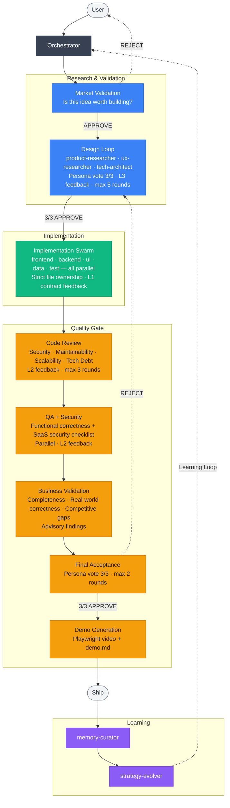

# Feature Lifecycle

Every feature goes through 9 phases (0-8) before shipping. State is persisted in `.claude/solo-dev-state.json` so sessions can resume from any phase.

## Overview



---

## Phase 0: Market Validation

**Agent:** `market-validator`

Validates the feature is worth building before any design work begins.

**Checks:**
- At least 2/3 competitors have this feature OR users explicitly requested it
- Feature ties to acquisition, activation, retention, or revenue
- Feature is on the right plan tier
- Can ship in ≤2 weeks
- No external dependency with >2-week integration risk

**Output:** `VIABLE` → Phase 1 | `NOT_VIABLE` → research agents revise or remove from queue

---

## Phase 1: Design Loop

**Agents:** R1 + R2 + R3 (parallel) → persona-validator (sequential)

1. Research agents produce spec independently, then synthesize:
   - R1: business flow, monetization
   - R2: UX, information architecture, user journey
   - R3: technical approach, API design, performance
2. `memory-curator` snapshots state + memory
3. `persona-validator` evaluates (all 3 personas vote)
   - 3/3 APPROVE → Phase 2
   - Any REJECT → research revises → re-vote
   - Max 5 rounds → human escalation

**Output:** `docs/specs/{feature-id}.md`

---

## Phase 2: Parallel Implementation

**Agents:** I1-I5 (frontend, backend, ui, data, test)

All 5 agents work simultaneously with strict file ownership boundaries.

Each agent:
1. Reads Repomix pack for code exploration
2. Reads relevant memory files (patterns, decisions)
3. Implements within file ownership boundaries
4. Validates against spec
5. Reports: `DONE` | `BLOCKED` | `NEEDS_CLARIFICATION`

`backend-agent` writes API contracts first → other agents validate before building (see [Agent Feedback Protocol](Agent-Feedback-Protocol.md) L1).

!!! note "Foundation Projects"
    If initialized from a template with existing `.claude/agents/`, solo-dev **delegates** implementation to the template's agents (they know the conventions better). solo-dev's implementation agents become fallback only. Example code from the template is automatically replaced when a real feature overlaps with it.

---

## Phase 3: Code Review Loop

**Agent:** `code-reviewer`

Reviews 4 dimensions in sequence:
1. **Security** — hardcoded secrets, input validation, injection, auth, OWASP
2. **Maintainability** — function size, file size, nesting, naming
3. **Scalability** — N+1 queries, indexes, pagination, stateless ops
4. **Tech Debt** — any types, TODOs, duplication, error handling

- APPROVE → Phase 4
- REJECT → targeted `CR_FEEDBACK` to specific agents → fix → re-review changed files only
- Max 3 rounds → architectural review escalation

---

## Phase 4 + 5: QA + Security (parallel)

**Agents:** `qa-validator` + `security-reviewer` (run in parallel)

**QA checks:** Functional correctness, business logic, integration, performance
**Security checks:** Auth & identity, multi-tenancy, payment, API, PII

- Both APPROVE → Phase 6
- QA FAIL → agents fix → CR re-checks → QA re-runs (max 3 rounds → re-enter Design Loop)
- Security REJECT → agents fix → security re-reviews

---

## Phase 6: Business Validation

**Agent:** `business-validator`

Reviews 4 dimensions:
1. Business logic completeness
2. Real-world correctness (domain-specific edge cases)
3. Competitive gap analysis
4. Enhancement opportunities (20% effort → 80% value)

- APPROVE → Phase 7
- CRITICAL issues → return to impl agents
- NON-CRITICAL → orchestrator asks user: "Add to this sprint or backlog?"

---

## Phase 7: Final Acceptance

**Agent:** `persona-validator`

Personas review the actual built feature (not just the spec).

- 3/3 APPROVE → Phase 8
- Any REJECT → back to impl → CR → QA → Final Acceptance
- Max 2 rounds → re-enter Design Loop entirely

---

## Phase 8: Demo Generation + Ship

**Agent:** `test-agent`

1. Writes Playwright scenario (happy path)
2. Checks dev server is running (prompts user if not)
3. Records video via Playwright `recordVideo`
4. Writes `demo.md` (what it is, why useful, real-world example)
5. Saves to `docs/demos/{feature-id}/`

Then orchestrator:
- git commit
- Update decisions.md
- Update memory index
- Mark feature `COMPLETE` in roadmap
- Load next feature → back to Phase 0

### Changelog Generation
After shipping, solo-dev adds a changelog entry to `docs/yaml/changelog.yaml` and regenerates `CHANGELOG.md` automatically.

**Fallback:** Playwright not installed → skip video, write demo.md only

---

## Loop Termination Rules

| Loop | Max Rounds | On Exceed |
|------|-----------|-----------|
| Design Loop | 5 | Human escalation |
| Code Review | 3 | Architectural review escalation |
| QA Loop | 3 | Re-enter Design Loop |
| Final Acceptance | 2 | Re-enter Design Loop entirely |

**Infinite loop prevention:**
- Each round MUST produce a diff (something must change)
- No diff → orchestrator terminates + escalates immediately
- Escalation logged to `docs/agents/memory/escalations.md`

---

## State Transitions

```
QUEUED
  → MARKET_VALIDATION
  → DESIGN_LOOP (rounds 1-5)
  → IMPLEMENTATION
  → CODE_REVIEW (rounds 1-3)
  → QA_LOOP + SECURITY_REVIEW (parallel, rounds 1-3)
  → BUSINESS_VALIDATION
  → FINAL_ACCEPTANCE (rounds 1-2)
  → DEMO_GENERATION
  → COMPLETE

Special states:
  ESCALATED       ← awaiting human decision
  ROLLED_BACK     ← feature reverted
  BLOCKED         ← dependency not complete
```
