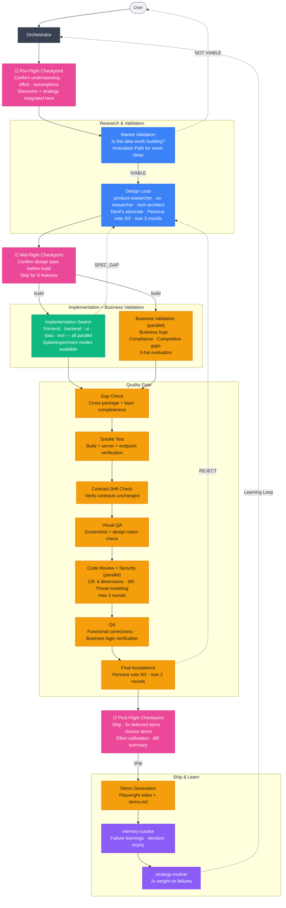

# Feature Lifecycle

Every feature goes through up to 8 phases (0 through 8) before shipping. Discovery and strategy are integrated into checkpoints rather than running as standalone phases. State is persisted in `.claude/solo-dev-state.json` so sessions can resume from any phase.

## Overview


```mermaid
flowchart TD
    classDef orch fill:#374151,color:#fff,stroke:#374151
    classDef research fill:#3b82f6,color:#fff,stroke:#2563eb
    classDef impl fill:#10b981,color:#fff,stroke:#059669
    classDef quality fill:#f59e0b,color:#1a1a1a,stroke:#d97706
    classDef memory fill:#8b5cf6,color:#fff,stroke:#7c3aed
    classDef terminal fill:#f3f4f6,stroke:#6b7280,color:#374151
    classDef checkpoint fill:#ec4899,color:#fff,stroke:#db2777

    U([User]):::terminal --> O[Orchestrator]:::orch

    O --> PF["☑ Pre-Flight Checkpoint<br/>Confirm understanding · effort · assumptions<br/>Discovery + strategy integrated here"]:::checkpoint

    subgraph RESEARCH["  Research & Validation  "]
        P0["Market Validation<br/>Is this idea worth building?<br/>Innovation Path for novel ideas"]:::research
        P12["Design Loop<br/>product-researcher · ux-researcher · tech-architect<br/>Devil's advocate · Persona vote 3/3 · max 3 rounds"]:::research
    end

    PF --> P0
    P0 -->|VIABLE| P12
    P0 -.->|NOT VIABLE| U

    P12 --> MF["☑ Mid-Flight Checkpoint<br/>Confirm design spec before build<br/>Skip for S features"]:::checkpoint

    subgraph IMPL["  Implementation + Business Validation  "]
        P2["Implementation Swarm<br/>frontend · backend · ui · data · test — all parallel<br/>Spike/experiment modes available"]:::impl
        BV["Business Validation (parallel)<br/>Business logic · Compliance · Competitive gaps<br/>3-hat evaluation"]:::quality
    end

    MF -->|build| P2
    MF -->|build| BV
    P2 -.->|SPEC_GAP| P12

    subgraph QUALITY["  Quality Gate  "]
        GC["Gap Check<br/>Cross-package + layer completeness"]:::quality
        ST["Smoke Test<br/>Build + server + endpoint verification"]:::quality
        DCH["Contract Drift Check<br/>Verify contracts unchanged"]:::quality
        VQA["Visual QA<br/>Screenshot + design token check"]:::quality
        P3["Code Review + Security (parallel)<br/>CR: 4 dimensions · SR: Threat modeling<br/>max 3 rounds"]:::quality
        P45["QA<br/>Functional correctness · Business logic verification"]:::quality
        P7["Final Acceptance<br/>Persona vote 3/3 · max 2 rounds"]:::quality
    end

    P2 --> GC
    BV --> GC
    GC --> ST
    ST --> DCH
    DCH --> VQA
    VQA --> P3
    P3 --> P45
    P45 --> P7
    P7 -.->|REJECT| P12

    P7 --> POF["☑ Post-Flight Checkpoint<br/>Ship · fix deferred items · choose demo<br/>Effort calibration · diff summary"]:::checkpoint

    subgraph SHIP_LEARN["  Ship & Learn  "]
        P8["Demo Generation<br/>Playwright video + demo.md"]:::quality
        MC[memory-curator<br/>Failure learnings · decision expiry]:::memory
        SE[strategy-evolver<br/>2x weight on failures]:::memory
    end

    POF -->|ship| P8
    P8 --> MC
    MC --> SE
    SE -.->|Learning Loop| O
```

---

## Discovery & Strategy (integrated into checkpoints)

**Agents:** `discovery-agent`, `venture-strategist`

Discovery and strategy are NOT standalone phases. They are integrated into existing checkpoints to avoid adding latency:

### Pre-Flight Discovery (silent)
During Pre-Flight data gathering:
1. If feature spec is vague (< 2 sentences) → dispatch discovery-agent silently
2. Run quick venture-strategist 10x Scan (30-second time-box)
3. Results appear inline in Pre-Flight briefing as `💡 STRATEGIC NOTE` or `⚠️ ASSUMPTION RISK`

### Design Loop Recovery
If persona-validator rejects same feature 2 times:
1. Before round 3, dispatch discovery-agent Mode 4 (Problem Reframing)
2. Present reframing alternatives to user before continuing

### On-Demand Full Analysis
User responds "explore 10x" at Pre-Flight → full venture-strategist analysis (all modes)

### Milestone Analysis (background)
After 3, 5, 8, or 12 completed features → venture-strategist Combinatorial Analysis runs in background. Never blocks feature flow.

### Spike & Experiment Modes
Not every idea needs full lifecycle:
- **Spike** (`--spike`): 30min feasibility check, throwaway code → `SPIKE_REPORT`
- **Experiment** (`--experiment`): 60min MVP, deployable to staging → success criteria evaluation

---

## 3-Checkpoint Interaction Protocol

solo-dev uses a **3-checkpoint** interaction model to minimize user interruption while preventing wasted work. All user interaction is concentrated at 3 natural boundaries:

```
PRE-FLIGHT ──→ [Phase 0-1] ──→ MID-FLIGHT ──→ [Phase 2-7] ──→ POST-FLIGHT
(ยืนยัน idea)                   (ยืนยัน design)                  (ยืนยัน ship)
```

### Checkpoint 1: Pre-Flight (before Phase 0)

Confirms understanding, effort, assumptions before research begins.
- Understanding summary + effort classification + [INFERRED] decisions + strategy note
- User responds: `go` | `adjust` | `explore 10x` | `skip`

### Checkpoint 2: Mid-Flight (after Phase 1, before Phase 2)

**The critical checkpoint.** User sees and confirms the design spec before any code is written.
- Spec summary: key decisions, scope boundaries, acceptance criteria
- Implementation plan: agents, file ownership, parallelism
- User responds: `build` | `change: ...` | `show full spec` | `pause`

**Why this exists:** The design spec is the most expensive artifact to get wrong. Confirming it before implementation prevents building the wrong thing entirely.

### Between Checkpoints 2 and 3: Uninterrupted Execution

Phases 2-7 run without user interruption. Only critical blockers interrupt:
- Loop max exceeded (CR 3 rounds, QA 3 rounds)
- Security REJECT that can't auto-resolve
- Implementation BLOCKED on external dependency

Everything else is deferred to Post-Flight (non-critical BV issues, demo decisions, visual warnings).

### Checkpoint 3: Post-Flight (after Phase 7, before Phase 8)

Confirms ship, reviews deferred items, chooses demo type.
- Execution summary + deferred items + demo staleness + demo plan
- User responds: `ship` | `fix: ...` | `demo: ...` | `ship no demo`

### Effort-Adaptive Checkpoints

| Effort | Pre-Flight | Mid-Flight | Post-Flight | Total |
|--------|-----------|-----------|-------------|:-----:|
| **S** | Compact 1-line | **SKIP** | Compact | **2** |
| **M** | Full | Full | Full | **3** |
| **L/XL** | Full + strategy | Full + "show full spec" | Full + combinatorial | **3** |

### Overnight Mode

Run multiple features unattended with `--overnight` flag. Checkpoints auto-proceed with safety guardrails:

- **Pre-Flight:** Always auto-proceed (research is low-risk)
- **Mid-Flight:** Auto-proceed for S/M/L. **Skip XL features entirely** (too risky unattended)
- **Post-Flight:** Auto-ship unless `must_fix` items or security REJECT exist

**Safety caps:** Max 3 features (configurable), max 20 total rounds. Never pushes to remote by default. Generates morning report at `docs/agents/memory/overnight-report-{date}.md`.

```bash
# Run overnight with tmux
tmux new -s overnight
/solo-dev:next-feature --overnight --max 5
# Ctrl+B, D to detach
```

---

## Phase 0: Market Validation

**Agent:** `market-validator`

Validates the feature is worth building before any design work begins.

**Checks:**
- At least 2/3 competitors have this feature OR users explicitly requested it
- Feature ties to acquisition, activation, retention, or revenue
- Feature is on the right plan tier
- Can ship in ≤2 weeks
- No external dependency with >2-week integration risk

**Output:** `VIABLE` → Phase 1 | `HIGH_RISK` → S: auto-ack, M+: user acknowledgment | `BLOCKER` → always requires user override

---

## Phase 1: Design Loop

**Agents:** R1 + R2 + R3 (parallel) → persona-validator (sequential)

1. Research agents produce spec independently, then synthesize:
   - R1: business flow, monetization
   - R2: UX, information architecture, user journey
   - R3: technical approach, API design, performance
2. `memory-curator` snapshots state + memory
3. `persona-validator` evaluates (all 3 personas vote)
   - 3/3 APPROVE → Phase 2
   - Any REJECT → research revises → re-vote
   - Max 3 rounds → human escalation

**Output:** `docs/specs/{feature-id}.md`

---

## Phase 2: Parallel Implementation

**Agents:** I1-I5 (frontend, backend, ui, data, test)

All 5 agents work simultaneously with strict file ownership boundaries.

Each agent:
1. Reads Repomix pack for code exploration
2. Reads relevant memory files (patterns, decisions)
3. Implements within file ownership boundaries
4. Validates against spec
5. Reports: `DONE` | `BLOCKED` | `NEEDS_CLARIFICATION`

`backend-agent` writes API contracts first → other agents validate before building (see [Agent Feedback Protocol](Agent-Feedback-Protocol.md) L1).

!!! note "Foundation Projects"
    If initialized from a template with existing `.claude/agents/`, solo-dev **delegates** implementation to the template's agents (they know the conventions better). solo-dev's implementation agents become fallback only. Example code from the template is automatically replaced when a real feature overlaps with it.

---

### Phase 2.5: Gap Check (cross-package + cross-layer)

**Agent:** gap-checker
**Config:** `gap_check.min_rounds` (default: 1), `gap_check.max_rounds` (default: 3) in `.claude/solo-dev.local.md`

Validates implementation completeness at two levels:
- **Cross-package** (monorepo only): Every package in Impact Map has changes
- **Cross-layer** (all projects): API endpoints have frontend pages, new pages have route registrations, auth-protected routes have guards, etc.

**Trigger points** (round counter is cumulative across all triggers):

| Trigger | When | Why |
|---------|------|-----|
| **Post-Implementation** | After all impl agents DONE, before code review | Mandatory first check — catches missing packages |
| **Post-CR Fix** | After code-reviewer REJECT → agents fix | Catches accidental package removal during CR fixes |
| **Post-QA Fix** | After QA FAIL → agents fix | Catches broken cross-package completeness during QA fixes |

On FAIL → targeted feedback to specific agents → fix → re-verify. On exceeding `max_rounds` → escalate to human.

---

### Phase 2.6: Smoke Test

**Agent:** `smoke-tester`
**Config:** `smoke_test.max_rounds` (default: 3) in `.claude/solo-dev.local.md`

Builds the project, starts the dev server, and tests critical endpoints to verify the implementation runs correctly at runtime. Catches build failures, server startup errors, and broken endpoints before code review.

**What it checks:**
1. Project builds without errors
2. Dev server starts within `smoke_test.timeout` seconds
3. Critical happy-path endpoints respond correctly
4. Error paths respond correctly (auth fail, invalid input, 404) — when `smoke_test.error_paths: true`

On FAIL → targeted feedback to specific implementation agents → fix → re-smoke. On exceeding `max_rounds` → escalate to human.

---

### Phase 2.7: Contract Drift Check

**Agent:** `drift-detector` (Contract Drift mode)
**Config:** `drift_detection.contract_checksum` in `.claude/solo-dev.local.md`

Verifies that API contracts defined at the start of implementation have not changed during the implementation phase. A checksum of each contract file is compared against the baseline recorded before implementation began.

**Why it matters:** Implementation agents sometimes quietly revise contracts to match what they built rather than what was designed. This gate catches that drift before it reaches code review.

On DRIFT DETECTED → flag to orchestrator → user decision: accept new contract or revert implementation.

---

### Phase 2.8: Visual QA

**Condition:** `design_profile` configured in `.claude/solo-dev.local.md` AND `visual_qa.enabled: true`
**Config:** `visual_qa` in `.claude/solo-dev.local.md`

Captures screenshots of all new/changed pages and verifies visual quality against the user's design profile. Ensures consistent visual identity across features.

**What it checks:**
1. **Design tokens** — no hardcoded colors, spacing, or radius outside the token system
2. **Responsive** — layout works at mobile (375px), tablet (768px), desktop (1440px)
3. **Dark mode** — renders correctly (if `design_profile.dark_mode` is `both`)
4. **Spacing** — consistent spacing scale used throughout
5. **Typography** — heading hierarchy follows design tokens
6. **Interactive states** — hover, focus, active, disabled all exist
7. **Loading/empty/error** — all states are implemented
8. **Navigation** — matches `design_profile.navigation` (pattern, menu structure, role-based, mobile adaptation)

On PASS → Phase 3. On FAIL → targeted feedback to `ui-agent` / `frontend-agent` → fix → re-check (max 2 rounds, then proceed with warnings).

If `visual_qa.user_preview: true` → screenshots shown to user for approval before proceeding.

**Skip conditions:** No `design_profile`, `visual_qa.enabled: false`, effort=S, API-only feature.

---

## Phase 3: Code Review + Security (parallel)

**Agents:** `code-reviewer` + `security-reviewer` (run in parallel)

**Code reviewer** reviews 4 dimensions (stack-aware limits):
1. **Logic Correctness** — algorithm correctness, edge cases, error paths
2. **Maintainability** — function size, file size, nesting, naming
3. **Scalability** — N+1 queries, indexes, pagination, stateless ops
4. **Tech Debt** — any types, TODOs, duplication, error handling

**Security reviewer** (sole owner of all security):
- Threat modeling, supply chain analysis, operational security
- Auth & identity, multi-tenancy, payment, API, PII

- Both APPROVE → Phase 4
- CR REJECT → targeted `CR_FEEDBACK` to specific agents → fix → re-review changed files only
- Security REJECT → agents fix → security re-reviews
- Max 3 rounds → architectural review escalation

---

## Phase 4 + 5: QA Validation

**Agent:** `qa-validator`

**QA checks:** Functional correctness, business logic, integration, performance

> **Note:** Security review now runs in parallel with code review (Phase 3). Business validation runs in parallel with implementation (Phase 2).

- APPROVE → Phase 7 (Final Acceptance)
- QA FAIL → agents fix → CR re-checks → QA re-runs (max 3 rounds → re-enter Design Loop)

---

## Business Validation (parallel with Phase 2)

**Agent:** `business-validator` (runs in parallel with implementation, not sequentially after QA)

Reviews using 3-hat evaluation:
1. Business logic completeness and compliance
2. Real-world correctness (domain-specific edge cases)
3. Competitive gap analysis and enhancement opportunities

- Findings feed into code review (Phase 3) — CRITICAL issues block CR approval
- NON-CRITICAL → orchestrator asks user: "Add to this sprint or backlog?"

---

## Phase 7: Final Acceptance

**Agent:** `persona-validator`

Personas review the actual built feature (not just the spec).

- 3/3 APPROVE → Phase 8
- Any REJECT → back to impl → CR → QA → Final Acceptance
- Max 2 rounds → re-enter Design Loop entirely

---

## Phase 8: Demo Generation + Ship

**Agent:** `test-agent`

1. Writes Playwright scenario (happy path)
2. Checks dev server is running (prompts user if not)
3. Records video via Playwright `recordVideo`
4. Writes `demo.md` (what it is, why useful, real-world example)
5. Saves to `docs/demos/{feature-id}/`

Then orchestrator:
- git commit
- Update decisions.md
- Update memory index
- Mark feature `COMPLETE` in roadmap
- Load next feature → back to Phase 0

### Changelog Generation
After shipping, solo-dev adds a changelog entry to `docs/yaml/changelog.yaml` and regenerates `CHANGELOG.md` automatically.

**Fallback:** Playwright not installed → skip video, write demo.md only

---

## Loop Termination Rules

| Loop | Max Rounds | On Exceed |
|------|-----------|-----------|
| Design Loop | 3 | Human escalation |
| Code Review | 3 | Architectural review escalation |
| QA Loop | 3 | Re-enter Design Loop |
| Final Acceptance | 2 | Re-enter Design Loop entirely |
| Smoke Test | 3 | Human escalation |
| Drift Check | 3 | Human escalation |
| Visual QA | 2 | Proceed with warnings (non-blocking) |

**Infinite loop prevention:**
- Each round MUST produce a diff (something must change)
- No diff → orchestrator terminates + escalates immediately
- Escalation logged to `docs/agents/memory/escalations.md`

---

## State Transitions

```
QUEUED
  → MARKET_VALIDATION
  → DESIGN_LOOP (rounds 1-3)
  → IMPLEMENTATION
  → GAP_CHECK (monorepo only)
  → SMOKE_TEST (rounds 1-3)
  → CONTRACT_DRIFT_CHECK
  → VISUAL_QA (if design_profile configured, max 2 rounds)
  → CODE_REVIEW + SECURITY_REVIEW (parallel, rounds 1-3)
  → QA_LOOP (rounds 1-3)
  → FINAL_ACCEPTANCE (rounds 1-2)
  → DEMO_GENERATION
  → COMPLETE

Special states:
  ESCALATED               ← awaiting human decision
  ROLLED_BACK             ← feature reverted
  BLOCKED                 ← dependency not complete
  DESIGN_LOOP_BACKTRACK   ← spec gap found during impl, returning to design
  SPIKE                   ← running spike feasibility check
  EXPERIMENT              ← running experiment MVP
```
